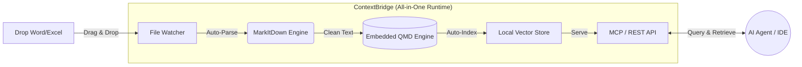

[**🇨🇳 中文**](README_zh-CN.md) |[**🇬🇧 English**](README.md)

# 🧠 ContextBridge (Beta)

> **The All-in-One Local Memory Bridge for AI Agents.**  
> Feed your local AI Agents (OpenClaw, Claude Code, Cursor) with Office documents, instantly. Batteries included.

[](https://opensource.org/licenses/MIT)
[](https://www.python.org/downloads/)
[]()

## 💡 Why build ContextBridge?

Most local AI Agents are great at reading code, but they are "blind" to your real-world business data hidden inside `.docx` and `.xlsx` files. 

Previously, if you wanted to build a local document retrieval system for your Agent, you had to endure a nightmare setup: *Install Node -> Install Bun -> Install a vector DB -> Configure PATHs -> Write a parsing script -> Connect them all...*

**ContextBridge fixes this by doing everything out-of-the-box.** 
We wrap Microsoft's high-fidelity `MarkItDown` parser and embed the blazing-fast `QMD` search runtime directly into one unified tool. No external dependencies, no complex configurations. **Just clone, install, and your Agent has a memory.**

---

## ✨ Core Features

- 🔋 **Batteries Included**: Comes with an embedded `qmd` search runtime. No need to manually install Bun, configure PATHs, or initialize indexes.
- 👁️ **Zero-Touch Sync**: Drop a Word or Excel file into the watched folder. ContextBridge automatically parses it to high-fidelity Markdown and rebuilds the local vector index instantly.
- 🔌 **Native Agent API & MCP**: Exposes a clean local API and an MCP (Model Context Protocol) interface. Connect it to OpenClaw or Claude Code with just one line of config.
- 🔒 **100% Local & Private**: No cloud APIs. Your financial reports and business documents never leave your machine.

---

## 🏗️ Architecture (Under the Hood)

ContextBridge abstracts away the complexity of modern RAG (Retrieval-Augmented Generation) pipelines into a single node:



---

## 🚀 Quick Start (Zero Config)

Forget about installing separate vector databases or search CLIs. We handle it all.

### 1. Install ContextBridge
Clone the repository and install the dependencies (Python 3.9+ required):
```bash
git clone https://github.com/yourusername/ContextBridge.git
cd ContextBridge
pip install -r requirements.txt
```
*(During installation, ContextBridge will automatically bootstrap the embedded search engine in the background).*

### 2. Start the Engine
```bash
python main.py
```
**That's it!** The engine is now running locally. It will automatically create a `~/ContextBridge_Workspace` directory on your machine.

### 3. Test the Magic
1. Drag and drop any `.docx` or `.xlsx` file into `~/ContextBridge_Workspace/raw_docs`.
2. Open your terminal and test the built-in search API directly:
```bash
# ContextBridge provides a global alias for instant searching
cbridge search "Summarize the Q3 revenue from the Excel file"
```

---

## 🤖 Connecting to Your AI Agent (MCP)

ContextBridge natively supports the **Model Context Protocol (MCP)**, making it a plug-and-play memory module for modern Agents.

**For Claude Code / Cursor / OpenClaw:**
Simply add ContextBridge to your agent's MCP configuration file:

```json
{
  "mcpServers": {
    "context-bridge": {
      "command": "python",
      "args": ["/path/to/ContextBridge/mcp_server.py"]
    }
  }
}
```
Once connected, your AI Agent will autonomously query ContextBridge whenever it needs to recall information from your Office documents.

---

## 🗺️ Roadmap & Vision

Our goal is to make ContextBridge the standard "Local Knowledge Component" for the AI Agent era.

- [x] **Phase 1: Unified Runtime** - Bundle MarkItDown and QMD engine into a single 1-click install workflow.
- [ ] **Phase 2: Expanded Modalities** - Auto-parse PDF (OCR), PPTX, and even local images.
- [ ] **Phase 3: GUI & Desktop App** - A lightweight Tauri-based menu bar app for non-developers to manage their Agent's memory visually.

---

## 🤝 Contributing

We welcome contributions! If you're passionate about local AI, RAG, and Developer Experience (DX), join us in building the ultimate memory bridge.

1. Fork the Project
2. Create your Feature Branch (`git checkout -b feature/AmazingFeature`)
3. Commit your Changes (`git commit -m 'Add some AmazingFeature'`)
4. Push to the Branch (`git push origin feature/AmazingFeature`)
5. Open a Pull Request

---

## 📜 License

Distributed under the[MIT License](LICENSE). 
