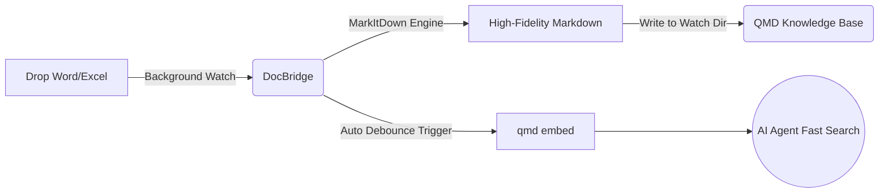

[**🇨🇳 中文**](README_zh-CN.md) |[**🇬🇧 English**](README.md)

# 📄 DocBridge (Beta)

> **The missing Office document bridge for your local AI Agents.**  
> A seamless bridge that breaks the Word/Excel memory barrier for your local AI Agents (like OpenClaw, Claude Code, and Cursor).

[](https://opensource.org/licenses/MIT)
[](https://www.python.org/downloads/)
[](http://makeapullrequest.com)

## 💡 Why build this?

[QMD](https://github.com/tobi/qmd) is currently one of the most powerful, fully local, and low-RAM AI knowledge retrieval engines. However, by design, it is a "text-purist" tool and cannot directly read complex office formats like `.docx` and `.xlsx`.

**DocBridge** is the ultimate sidecar tool built to solve this. Through fully automated background monitoring, the moment you drop a Word or Excel file into a folder, it converts it into high-fidelity Markdown and automatically triggers QMD to update its vector index. 

**Drop your Office files in, and your local AI Agent can instantly "read" and "remember" them. 100% local, zero cloud uploads, and absolute privacy.**

---

## ✨ Core Features

- 👁️ **Millisecond Monitoring**: System-level background file monitoring powered by `watchdog` for zero-latency awareness.
- 🪄 **High-Fidelity Conversion**: Under the hood, it leverages Microsoft's open-source `MarkItDown` engine to accurately parse complex tables and layouts.
- ⚡ **Automated QMD Sync**: Built-in debounce mechanism to smartly trigger `qmd embed` without overloading your system.
- 🔒 **100% Privacy**: No cloud APIs required. Everything is parsed and embedded entirely on your local machine.
- 🤖 **Perfect Agent Companion**: The ideal plugin for MCP-supported local AI frameworks like OpenClaw, Cursor, and Claude Code.

---

## 🏗️ How it works



---

## 🚀 Quick Start

### 1. Prerequisites
Ensure you have **Python 3.9+** installed, and [QMD](https://github.com/tobi/qmd) is globally installed and properly configured on your machine.

### 2. Install DocBridge
Clone this repository and install the required dependencies:
```bash
git clone https://github.com/yourusername/DocBridge.git
cd DocBridge
pip install -r requirements.txt
```
*(Note: `requirements.txt` mainly contains `markitdown` and `watchdog`)*

### 3. Configuration
Copy the example config file and set up your watch directories:
```bash
cp config.example.yaml config.yaml
```
Edit `config.yaml`:
```yaml
paths:
  # The directory where you drop your raw Word/Excel files
  raw_office_dir: "~/Documents/office_raw"
  # The output directory for the converted Markdown files (watched by QMD)
  markdown_output_dir: "~/Documents/md_ready"
  
qmd:
  # Debounce time (in seconds) before triggering index rebuild
  debounce_seconds: 10 
```

### 4. Link to QMD
Add the markdown output directory to your QMD knowledge base:
```bash
qmd collection add ~/Documents/md_ready --name office_docs --mask "**/*.md"
```

### 5. Run the Bridge
```bash
python main.py
```
🎉 **Boom! You're all set!** Now, try dropping an `.xlsx` financial report into the `office_raw` folder, and ask your AI Agent (or type in the terminal): `qmd query "summarize the data in the latest report"` to witness the magic!

---

## 🗺️ Roadmap

We envision DocBridge not just as a geeky script, but evolving into a comprehensive local data bridge for all knowledge workers.

### Phase 1: Core Engine (Current)
- [x] Auto-watch & convert Word (`.docx`) and Excel (`.xlsx`).
- [x] Auto-trigger QMD vector indexing with debounce logic.
- [ ] Add parsing support for PPT (`.pptx`) and PDF (`.pdf`).

### Phase 2: Out-of-the-Box (Upcoming)
- [ ] Package into standalone executables (Windows `.exe`, macOS `.dmg`) - no Python environment needed!
- [ ] Support PM2 / Systemd for one-click daemon/background service registration.

### Phase 3: Desktop Product Vision
- [ ] Build a lightweight GUI using Tauri / Electron.
- [ ] System Tray integration to visually monitor conversion status and QMD index health.
- [ ] Dashboard statistics: Number of documents processed and estimated LLM API token costs saved.

---

## 🤝 Contributing

Pull Requests and Issues are highly welcome! If you are interested in collaborating to turn this into a commercial/desktop product (Phase 3), feel free to reach out via email.

1. Fork the Project
2. Create your Feature Branch (`git checkout -b feature/AmazingFeature`)
3. Commit your Changes (`git commit -m 'Add some AmazingFeature'`)
4. Push to the Branch (`git push origin feature/AmazingFeature`)
5. Open a Pull Request

---

## 📜 License

Distributed under the [MIT License](LICENSE).

---
*If this project saves your time (and LLM API tokens), please consider giving it a ⭐️!*
