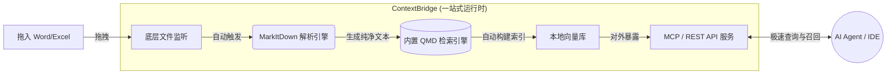

[**🇨🇳 中文**](README_zh-CN.md) | [**🇬🇧 English**](README.md)

# 🧠 ContextBridge (Beta)

> **AI Agent 的一站式本地记忆桥梁。**  
> 为你的本地 AI Agent（如 OpenClaw, Claude Code, Cursor）即刻投喂真实世界的 Office 文档。自带引擎，开箱即用。

[](https://opensource.org/licenses/MIT)
[](https://www.python.org/downloads/)
[]()

## 💡 为什么开发 ContextBridge？

大多数本地 AI Agent 擅长阅读代码，但面对隐藏在 `.docx` 和 `.xlsx` 文件里的真实业务数据时，它们却像“瞎子”一样。

在过去，如果你想为本地 Agent 搭建一个文档检索系统，你必须经历一场“配置地狱”：*装 Node -> 装 Bun -> 装向量数据库 -> 配置各种环境变量 -> 写个解析脚本 -> 把它们全连起来……*

**ContextBridge 终结了这一切。** 
我们将微软高保真的 `MarkItDown` 解析神器和极速的 `QMD` 搜索运行时直接打包成了一个独立工具。没有外部依赖，告别繁琐配置。**只需 Clone，Install，你的 Agent 瞬间就拥有了记忆。**

---

## ✨ 核心特性

- 🔋 **自带引擎 (Batteries Included)**：内置了 `qmd` 检索运行时。不再需要手动安装环境、配置 PATH 或操心向量索引的初始化，我们在底层全替你搞定。
- 👁️ **无感同步 (Zero-Touch Sync)**：只需把 Word 或 Excel 文件丢进监听目录，ContextBridge 会在后台自动将其转换为高保真的 Markdown，并瞬间重建本地向量索引。
- 🔌 **原生支持 Agent API 与 MCP 协议**：对外提供纯净的本地 API 与最新的 MCP (Model Context Protocol) 接口。只需一行配置，即可无缝接入 OpenClaw 或 Claude Code。
- 🔒 **100% 本地与绝对隐私**：不依赖任何云端大模型 API。你的财务报表和核心业务文档永远只留在你的电脑硬盘里。

---

## 🏗️ 架构设计 (底层原理)

ContextBridge 将现代 RAG (检索增强生成) 管道的复杂性彻底黑盒化，封装成了一个单节点：



---

## 🚀 快速开始 (真正的零配置)

忘掉那些繁琐的向量数据库和 CLI 工具安装教程吧，一切交给我们。

### 1. 安装 ContextBridge
克隆本仓库并安装依赖（需要 Python 3.9+ 环境）：
```bash
git clone https://github.com/yourusername/ContextBridge.git
cd ContextBridge
pip install -r requirements.txt
```
*(在首次运行时，ContextBridge 会在后台自动拉取并初始化内置的搜索引擎)*。

### 2. 启动引擎
```bash
python main.py
```
**搞定了！** 检索后台已在本地静默运行。它会在你的电脑上自动创建一个 `~/ContextBridge_Workspace` 专用工作区。

### 3. 见证魔法
1. 将电脑里任意一个 `.docx` 或 `.xlsx` 文件拖入 `~/ContextBridge_Workspace/raw_docs` 文件夹。
2. 打开一个新的终端，直接使用我们提供的全局测试 API 来检验：
```bash
# ContextBridge 提供了一个极简的命令行入口用于测试
cbridge search "总结一下刚才那个 Excel 表格里的 Q3 营收数据"
```

---

## 🤖 接入你的 AI Agent (基于 MCP)

ContextBridge 原生支持 **Model Context Protocol (MCP)** 协议，这让它成为了现代 AI Agent 即插即用的完美记忆模块。

**对于 Claude Code / Cursor / OpenClaw：**
你只需要在 Agent 的 MCP 配置文件中加入 ContextBridge 的服务路径即可：

```json
{
  "mcpServers": {
    "context-bridge": {
      "command": "python",
      "args":["/绝对路径/至/ContextBridge/mcp_server.py"]
    }
  }
}
```
连接成功后，每当你的 AI Agent 需要回想你的办公文档信息时，它就会自主调用 ContextBridge 进行精准的高级语义查询。

---

## 🗺️ 产品演进路线图

我们的愿景是让 ContextBridge 成为 AI Agent 时代标配的“本地外接记忆脑区”。

- [x] **第一阶段：一站式运行时** - 整合 MarkItDown 和 QMD 引擎，实现一键安装与全自动工作流。
- [ ] **第二阶段：多模态支持** - 增加对 PDF (OCR 扫描件)、PPTX 甚至本地图像的解析与索引支持。
- [ ] **第三阶段：桌面端与可视化** - 基于 Tauri 开发极轻量级的状态栏应用，让非技术人员也能直观管理 Agent 的记忆库。

---

## 🤝 参与贡献

我们极其欢迎任何形式的贡献！如果你对本地化 AI、RAG 技术以及极致的开发者体验（DX）充满热情，请加入我们，一起构建最强的 AI 记忆桥梁。

1. Fork 本仓库
2. 创建你的特性分支 (`git checkout -b feature/AmazingFeature`)
3. 提交你的代码 (`git commit -m 'Add some AmazingFeature'`)
4. 推送至远端分支 (`git push origin feature/AmazingFeature`)
5. 提交 Pull Request

---

## 📜 许可证

本项目采用 [MIT License](LICENSE) 协议开源。
