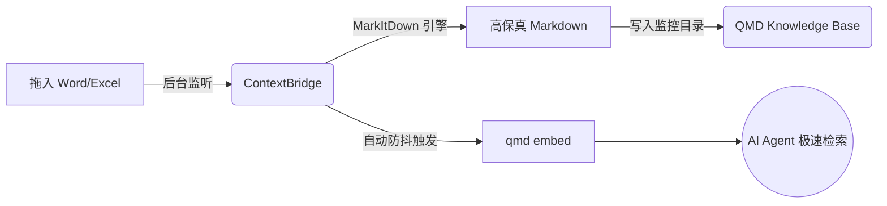

# ContextBridge (Beta)

> **The missing Office document bridge for your local AI Agents.**  
> 为你的本地 AI Agent（如 OpenClaw, Claude Code）打通 Word/Excel 记忆壁垒的无缝桥梁。

[](https://opensource.org/licenses/MIT)
[](https://www.python.org/downloads/)
[](http://makeapullrequest.com)

## 💡 为什么开发这个项目？

[QMD](https://github.com/tobi/qmd) 是目前地表最强的纯本地、低显存 AI 知识库检索引擎。但它天生是一个“纯文本原教旨主义者”，无法直接读取复杂的 `.docx` 和 `.xlsx` 办公文档。

**ContextBridge** 就是为此而生的旁路桥接工具。它通过全自动的后台监听，在你将 Word/Excel 拖入文件夹的瞬间，以极高的保真度将其转换为 Markdown，并自动触发 QMD 更新向量索引。

**把 Office 文件扔进去，你的本地 AI Agent 立刻就能“读懂”它们。全程 100% 本地运行，绝不上传任何私密业务数据。**

---

## ✨ 核心特性

- 👁️ **毫秒级极速监听**：基于 `watchdog` 的系统级底层文件监控，感知无延迟。
- 🪄 **高保真格式转换**：底层集成微软开源的 `MarkItDown` 引擎，精准解析复杂表格与排版。
- ⚡ **全自动 QMD 同步**：自带防抖（Debounce）机制，智能触发 `qmd embed` 构建向量索引。
- 🔒 **100% 隐私安全**：无需任何云端 API，完全在你的本地机器上完成解析和嵌入。
- 🤖 **Agent 绝佳伴侣**：完美适配 OpenClaw, Cursor, Claude Code 等支持 MCP 协议的本地 AI 框架。

---

## 🏗️ 工作流 (How it works)



---

## 🚀 快速开始

### 1. 环境准备
确保你的电脑已安装 **Python 3.9+**，并且已经全局安装并配置好了 [QMD](https://github.com/tobi/qmd)。

### 2. 安装 ContextBridge
克隆本仓库并安装依赖：
```bash
git clone https://github.com/yourusername/ContextBridge.git
cd ContextBridge
pip install -r requirements.txt
```
*(注：`requirements.txt` 包含 `markitdown` 和 `watchdog`)*

### 3. 配置目录
在项目根目录复制一份配置文件，并设置你想要监听的目录和 QMD 知识库目录：
```bash
cp config.example.yaml config.yaml
```
修改 `config.yaml`：
```yaml
paths:
  # 你平时存放/拖入 Word, Excel 文件的目录
  raw_office_dir: "~/Documents/office_raw"
  # 转换后供 QMD 读取的 Markdown 目录
  markdown_output_dir: "~/Documents/md_ready"
  
qmd:
  # 触发索引重建的防抖时间（秒）
  debounce_seconds: 10 
```

### 4. 链接至 QMD
将输出目录添加到你的 QMD 知识库中：
```bash
qmd collection add ~/Documents/md_ready --name office_docs --mask "**/*.md"
```

### 5. 一键启动
```bash
python main.py
```
🎉 **完成！** 现在，试着往 `office_raw` 文件夹里扔一个 `.xlsx` 财务报表，然后用你的 AI Agent 或直接在终端输入 `qmd query "总结一下报表数据"` 体验魔法吧！

---

## 🗺️ 产品演进路线图 (Roadmap)

我们不仅希望这是一个好用的极客脚本，更致力于将其打造为面向知识工作者的**全能型本地数据桥梁产品**。

### Phase 1: 核心引擎 (当前)
- [x] Word (`.docx`), Excel (`.xlsx`) 自动监听与转换
- [x] QMD 向量索引自动触发与防抖联动
- [ ] 增加对 PPT (`.pptx`) 和 PDF (`.pdf`) 的解析支持

### Phase 2: 开箱即用 (近期规划)
- [ ] 打包为多平台可执行文件 (Windows `.exe`, macOS `.dmg`)，无需配置 Python 环境。
- [ ] 支持 PM2 / Systemd 一键注册为开机自启系统服务。

### Phase 3: 桌面端产品化 (产品愿景)
- [ ] 基于 Tauri / Electron 开发轻量级 GUI 界面。
- [ ] 状态栏（System Tray）挂载，可视化查看转换进度和 QMD 索引状态。
- [ ] 提供统计面板：已处理的文档数、为大模型节省的 Token 费用估算。

---

## 🤝 参与贡献

欢迎提交 Pull Request 或发起 Issue！如果你对将它包装为商业产品（Phase 3）有兴趣，欢迎直接通过邮件联系我探讨合作。

1. Fork 本仓库
2. 创建你的特性分支 (`git checkout -b feature/AmazingFeature`)
3. 提交你的更改 (`git commit -m 'Add some AmazingFeature'`)
4. 推送到分支 (`git push origin feature/AmazingFeature`)
5. 开启一个 Pull Request

---

## 📜 许可证

本项目采用 [MIT License](LICENSE) 开源。

---
*If this project saves your time (and LLM API tokens), please give it a ⭐️!*
