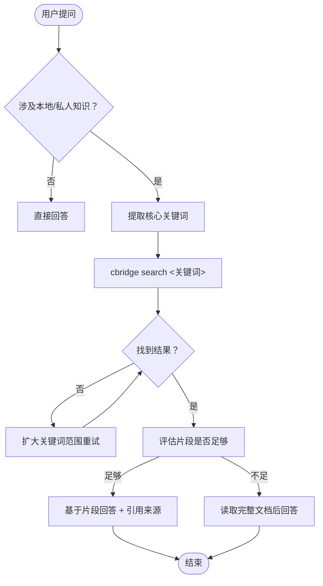

# ContextBridge 本地知识库

通过 `cbridge` CLI 搜索本地文档的语义内容。所有数据保留在本地，100% 隐私安全。

---

## 🚀 快速启动

### 1. 安装（首次）

```bash
pip install cbridge-agent
```

### 2. 初始化（首次）

```bash
cbridge init
```

### 3. 添加监控目录

```bash
cbridge watch add /path/to/documents
cbridge watch list
```

### 4. 搜索

```bash
cbridge search <关键词>
```

---

## 🎯 核心工作流



---

## 💡 搜索最佳实践

### 关键词提取

| 推荐 ✅ | 避免 ❌ |
|---------|--------|
| `2024 营销预算` | `2024 年的营销预算是多少？` |
| `采购政策` | `我们公司的采购政策是什么` |
| `Python 编码规范` | `帮我找找 Python 的编码规范` |

### 迭代策略

1. **精确关键词** → 无结果 → **扩大范围**
2. 尝试同义词或相关术语
3. 最多重试 2-3 次

### 引用要求

始终标注来源：
- "根据 `budget.xlsx` 的内容..."
- "如 `employee_handbook.pdf` 所述..."

---

## 📋 完整命令参考

详见 [`references/cli-reference.md`](references/cli-reference.md)

---

## 🔧 故障排查

详见 [`references/troubleshooting.md`](references/troubleshooting.md)

---

## 📚 资源

- **GitHub**: <https://github.com/whyischen/context-bridge>
- **配置**: `~/.cbridge/config.yaml`
- **工作区**: `~/.cbridge/workspace`
